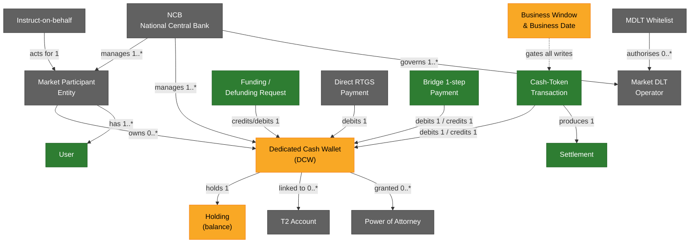
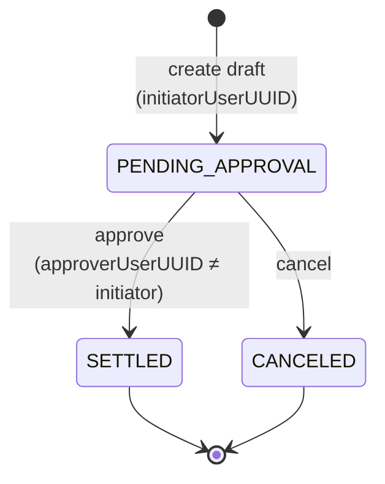
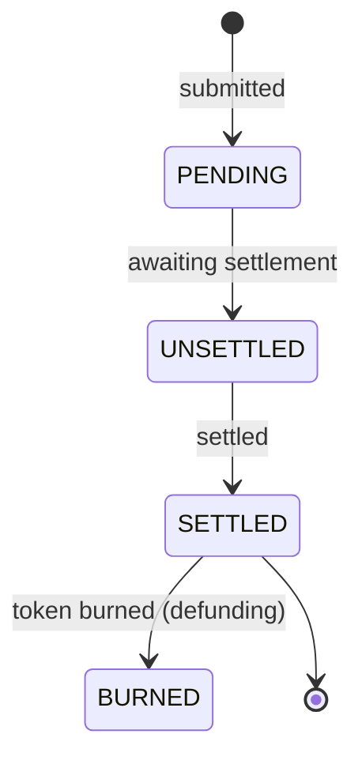
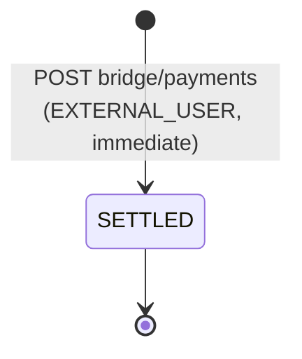
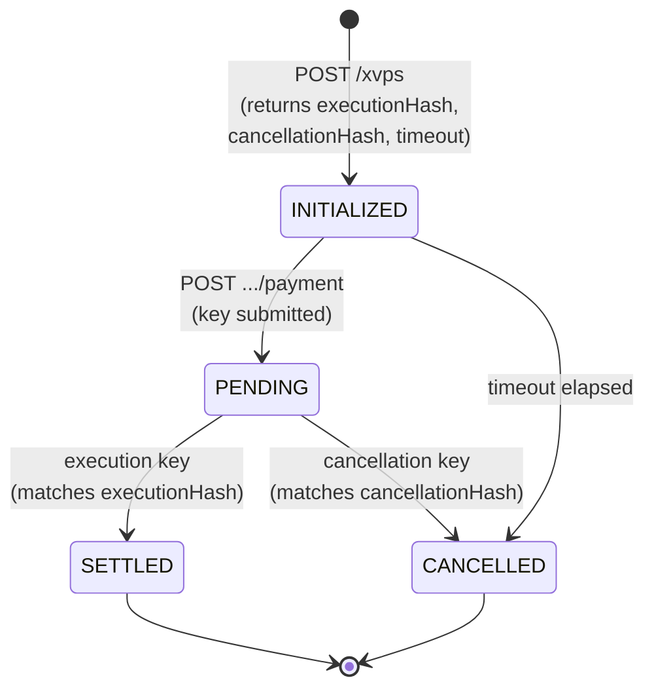

# Pontes domain model (objects, cardinalities & lifecycles)

A functional map of the concepts the ECB Pontes A2A API manipulates — the
business objects, how they relate (cardinalities), their key fields, and how
their state changes — plus **which concepts this mock implements today**.

> Scope: this is a **functional** model. Security/transport layers (mTLS, OAuth2
> JWT, NRO signing) are intentionally **excluded** — except the **User** concept,
> which is a first-class functional object. For the security layers see
> [`TLS-MTLS-AND-CERTS.md`](TLS-MTLS-AND-CERTS.md). For endpoint-by-endpoint
> coverage see [`ENDPOINT-COVERAGE.md`](ENDPOINT-COVERAGE.md).
>
> Source: the vendored official spec `src/ui/spec/pontes-official-v1.0.json`
> (EII API v1.0.0).

## Legend

| Colour | Meaning |
|--------|---------|
| 🟢 **Implemented** | the mock exposes and drives this concept |
| 🟡 **Partial** | present but simplified (e.g. read-only, auto-created, not enforced) |
| ⚪ **Not implemented** | defined by the official API, not in the mock yet |

---

## 1. Concept map

---

## 2. Concepts

### 2.1 NCB (National Central Bank) ⚪

The managing central bank / realm. Every object is scoped to an NCB (the `{ncb}`
path segment and the OAuth realm). Referenced by `managerID` / `managerNCB` on
wallets and entities.

- Key fields: `bic`, `name`, `country`.
- Cardinality: **1 NCB → many** Entities, DCWs, Market DLT Operators.
- Official endpoints: `GET .../grs/ncbs`, `.../grs/ncbs/{id}`. **Not implemented**
  (the mock hard-codes the NCB from the realm).

### 2.2 Market Participant Entity ⚪

A participant in the ESY DLT (a bank/PSP), identified by BIC.

- **Create** (`globalregistry.CreateEntity`, 2-step): `entityID`, `entityIDType`
  (`BIC`), `name`, `shortName`, `countryCode`, `rolesTable`, `validFrom`/`validTo`.
- **Read** (`globalregistry.Entity`) adds: `id`, `mspID`, `domain`, `isBlocked`,
  `isPrivate`, `status`, `fourEyesType`, `instructingPartyID`, `initiatorUserUUID`,
  `historicStatus`, `timestamps`, `lastUpdated`.
- Blocking is toggled via `PATCH .../grs/entities/{id}` (`isBlocked`).
- Cardinality: owns **0..\*** DCWs; groups **1..\*** Users.
- Official endpoints: `grs/entities` (create 2-step, list, get, patch blocking).
  **Not implemented** — the mock infers the owning entity from the wallet alias
  / enrolled user's `entityBIC`.
- States: `PENDING_APPROVAL` → `ACTIVE` (approve) / `CANCELED` (cancel); then
  `ACTIVE` ⇄ `BLOCKED` via patch.

### 2.3 User 🟢

A named human/service identity that authenticates and initiates/approves
operations. **The only security-adjacent object included here.**

- Key fields: `username`, `entity`/`externalEntity`, `roles`, `email`, `enabled`,
  `networkID`, plus (mock) `profile` (`PILOT_READ_WRITE`, `EXTERNAL_USER`, …) and
  `entityBIC`.
- Cardinality: belongs to **1** Entity; a 2-step operation involves **2 distinct**
  Users (`initiatorUserUUID` ≠ `approverUserUUID`).
- Mock: declared + certificate-enrolled via the IAM/Keycloak endpoints
  (`.../openid-connect/token`, `/csr`, `/certs`, `admin/enrolled-users`).
- Tokens (issue #64): the password grant returns an ES256 `access_token`
  (`expires_in` 300s) **and** a `refresh_token` (`refresh_expires_in` 864000s =
  10 days), Keycloak-style. The token endpoint also accepts
  `grant_type=refresh_token` to mint a fresh pair; a refresh token cannot be used
  as a bearer access token (`typ: "Refresh"` is rejected by the JWT middleware).

### 2.4 Dedicated Cash Wallet (DCW) 🟡

The cash-token account holding a balance.

- Key fields: `walletAlias`, `ownerEntityID`, `managerID` (NCB), `isMainWallet`,
  `status`, `fourEyesType`, `validFrom`/`validTo`, `holdingTable`,
  `t2AccountWalletLinks`, `POAs`.
- Cardinality: owned by **1** Entity, managed by **1** NCB; holds **1** Holding
  per currency; linked to **0..\*** T2 Accounts.
- Official: create (2-step), list, get, get settled transactions, total-under-mgmt.
- Mock: **read** (`GET .../ams/wallets`, `.../{walias}`, `.../transactions`) and
  **create** (`POST .../ams/wallets`) implemented. Wallet creation is scoped to
  the caller's **own entity** — the owner is taken from the verified JWT, never
  the request body (issue #77). Auto-creation is now **funding-only**: funding
  creates the credited wallet for the caller's entity if it doesn't exist (issue
  #23/#77); **every other settlement path rejects an unknown credited wallet**
  with `422 HL-WAL-003` rather than silently discarding the credit (which
  destroyed cash — conservation of value, issue #77). A missing **debit-side**
  wallet still raises `422 HL-WAL-002`. As of #13 the DCW is properly modelled:
  **`availableBalance` +
  `lockedBalance`** (invariant available + locked = total), per-currency
  holdings, `isBlocked`/validity, and **debit rights** (only a user of the owning
  entity may debit by default; PoA grantees / whitelisted operators too). The
  store exposes `credit`/`debit`/`lock`/`release`/`settleLocked` + `canDebit`,
  persisted to **Redis when `REDIS_URL` is set**. Still missing: the official
  2-step **creation** flow and T2-link modelling.

### 2.5 Holding 🟡

A balance line inside a DCW.

- Key fields: `holdingID`, `walletAlias`, `amount`, `type`, `modalityType`.
- Cardinality: **1 DCW → 1..\*** Holdings (per currency/modality). The mock
  exposes an `AVAILABLE` and a `LOCKED` holding per wallet (EUR).

### 2.6 T2 Account ⚪

An RTGS (TARGET2) account reference a DCW is linked to for funding/defunding.

- **Create** (`accountmanagement.CreateT2Account`, 2-step): `accountReference`,
  `countryCode`, `links` (array of `T2AccountWalletLink`).
- **Read** (`accountmanagement.T2Account`) adds: `id`, `managerID`, `status`,
  `fourEyesType`, `instructingPartyID`, `initiatorUserUUID`, `historicStatus`,
  `timestamps`, `lastUpdated`.
- Cardinality: linked to **0..\*** DCWs via `T2AccountWalletLink`.
- States: `PENDING_APPROVAL` → `ACTIVE` / `CANCELED`.
- Official: create (2-step), list, get. **Not implemented** — funding treats the
  token-issuance wallet as an infinite source instead.

### 2.7 Power of Attorney (PoA) ⚪

Authorises a party to operate a DCW on behalf of the owner.

- Fields: `id`, grantor/authorised party, `status`, `fourEyesType`,
  `validFrom`/`validTo` (embedded in the wallet's `POAs` array).
- Cardinality: **0..\*** per DCW.
- States: `PENDING_APPROVAL` → `ACTIVE` / `CANCELED`.
- Official: `ams/poa-drafts` (create 2-step), `ams/poa/{id}`. **Not implemented.**

### 2.8 Cash-Token Transaction 🟢

A wallet-to-wallet cash-token transfer/payment (2-step).

- Key fields: `id` (the draft/transaction identifier, matching the official
  `*.Response` schemas), `amountTransferred`, `currency`
  (`EUR`), `creditedCashWalletAlias`, `debitedCashWalletAlias`,
  `creditedCashWalletManagerID`, `debitedCashWalletManagerID`, `type`,
  `cbdcRequestType`, `instructingPartyID`, `status`, and the non-official
  `supplementaryData` ("reason of payment").
- Cardinality: debits **1** DCW, credits **1** DCW; produces **1** Settlement.
- Mock: `POST .../rvs/transactions-requests` (draft) + `PUT .../transactions-drafts/{id}/approve|cancel`.
- **Id sourcing** (issue #32): a client-supplied instruction id is honoured where
  the official request schema carries one (RVS transfer `instructionID`,
  direct-RTGS `id`); otherwise the mock mints a deterministic **daily-sequence**
  id `{PREFIX}{yyMMdd}{seq:06}` (`TR`/`FRQ`/`DRQ`/`DRTGS`) — monotonic and
  collision-safe (no `Math.random`). A duplicate client id → `409 HL-GER-004`.

### 2.9 Settlement 🟢 (read) / octopus.Settlement

The settled record of a transaction / funding movement (the transactions query).

- Key fields: `settlementID`, `amount`, `currency`, `moveSource`/`moveDestination`
  (+ manager/owner), `moveDirection`, `moveType`, `settlementDate`/`settlementTime`,
  `operationContext` (`Cross`/`Intra`), `supplementaryData`.
- Mock: surfaced via `GET .../ims/transactions` (returns in-flight drafts rather
  than the full settled-extract model).

### 2.10 Funding / Defunding Request 🟢

Moves cash between a T2 account and a DCW (2-step, NRO-signed).

- Key fields: `techFundRequestID`, `amount`, `currency`, `type`,
  `creditedCashWalletAlias`/`ManagerID`/`OwnerID`,
  `debitedCashWalletAlias`/`ManagerID`/`OwnerID`, `signature`, `signerPEM`.
- Cardinality: credits (funding) or debits (defunding) **1** DCW.
- Mock: `POST .../tms/funding-requests` & `.../defunding-requests` (draft) +
  `.../{id}/approve` (funding also `cancel`; defunding approve-only). The
  token-issuance wallet is treated as an **infinite** source.

### 2.11 Direct RTGS Payment 🟡

A payment settling directly on RTGS (TARGET2), NRO-signed. Modelled in the mock
as a **composite** of a *defunding on the payer* + a *funding on the receiver*.

- Fields (`triggermanagement.DirectRTGSPaymentInstruction`): `id`,
  `correlationId`, `amount`, `currency`, `payerBank`, `receiverBank`,
  `signature`, `signerPEM`.
- NRO signing string: `id + amount + payerBank + receiverBank`.
- States: `PENDING_APPROVAL` → `SETTLED` / `CANCELED` (2-step) for the
  `tms/direct-rtgs/payments` variant; the `bridge/direct-rtgs/payments` variant
  is 1-step. **Implemented** as `DirectRtgsWorkflow` (checked debit of the payer
  + credit of the receiver): 2-step checks availability + debit rights at approval
  with four-eyes; 1-step checks immediately.

### 2.12 Bridge 1-step Payment 🟢 (cash-token) / 🟢 (PFoD) / 🟢 (XvP)

Immediate settlement, no draft/approve cycle.

- Key fields (`bridge.PaymentRequest`): `paymentID`, `amount`, `currency`,
  `creditedCashWalletAlias`/`ManagerID`, `debitedCashWalletAlias`/`ManagerID`.
- Mock: `POST .../bridge/payments` implemented (EXTERNAL_USER).
- **PFoD** (Payment-Free-of-Delivery) — **implemented** as two matched legs on
  `tradeID` (deliver=`bridge.PFoDDeliRequest`, receive=`bridge.PFoDReceRequest`);
  the matched wallet payment fires once both legs are present and consistent.
- **XvP** (`/igw/**`) — **implemented**; see §4 for the full protocol.

### 2.13 Market DLT Operator & Whitelist ⚪

Registry of DLT platform operators and their authorisation whitelist.

- `MarketDLTOperator`: `mdltOperatorID`, `operatorID`, `networkID`,
  `responsibleNCB`, `isBlocked`.
- `CreateMarketDLTOperatorWhitelist`: `managerID`, `marketDLTOperatorID`,
  `marketDLTPlatformID`, `participantID`, `validFrom`/`validTo`.
- Cardinality: a Whitelist authorises **0..\*** operators for a platform.
- States: `PENDING_APPROVAL` → `ACTIVE` / `CANCELED`; `ACTIVE` ⇄ `BLOCKED`.
  **Not implemented.**

### 2.14 Instruct-on-behalf ⚪

An operation an operator/authorised party instructs for another entity.

- Fields (`triggermanagement.CreateInstructOnBehalf`): `grantorParticipantBIC`,
  `authorizedParticipantBIC` (the AMS variant adds wallet context).
- States: `PENDING_APPROVAL` → `ACTIVE` / `CANCELED`.
- Official: `tms/instruct-on-behalf-drafts`, `ams/...`. **Not implemented.**

### 2.15 Business Window & Business Date 🟡

The market calendar gating when operations may settle.

- `BusinessWindow`: `windowName` (Start of Day / Open for All / End of Day /
  Closed), `startTime`, `endTime`, `nextWindowName`.
- `BusinessDate`: `businessDate`, `updateBDStatus`
  (`FULL_UPDATE_ALLOWED` / `UPDATE_NOT_ALLOWED` / `CONDITIONAL_UPDATE_ALLOWED`).
- Mock: `GET .../bridge/current-business-window`, `.../grs/current-business-window`,
  `.../grs/businessdate` implemented. `windowName` is derived from the stored
  `openTime`/`closeTime` in **Frankfurt** time (`Open for All` inside the window,
  else `Closed`). Enforcement on writes is **opt-in** via
  `PONTES_MOCK_ENFORCE_BUSINESS_WINDOW=true` (issue #59): when enabled, mutating
  official API calls outside the window are rejected with `403 HL-BW-001`. An
  admin can hard-close the window with `currentWindow: "CLOSED"`.

---

## 3. Lifecycles (state changes)

### 3.1 The 2-step (4-eyes) draft lifecycle

Every create operation on Wallets, T2 Accounts, Entities, Transactions,
Funding/Defunding, Direct RTGS, mDLT Operators/Whitelists, PoA and
Instruct-on-behalf follows the same shape — the `{status}` path segment is always
`approve` or `cancel`, and the approver must differ from the initiator.

In the mock this is implemented for **transactions** and **funding/defunding**
(🟢); the same lifecycle for **entities, wallets, T2 accounts, PoA, mDLT** is ⚪
not implemented. Behaviour: `404` on unknown draft, `409` if not `PENDING_APPROVAL`.

**Generic Workflow engine.** All money-movement operations (2-step transfer,
funding, defunding, direct-RTGS, the 1-step bridge payment, matched PFoD and the
fund-locking XvP) share a single `Workflow` base (`src/workflows/`) that implements exactly this
state machine plus two extension points: `conditions(phase)` (validate/authorise
a transition) and `apply()` (the DCW debit/credit effect at settlement). One-step
workflows collapse `create`+`approve` into a single `execute()`. Consistent with
the availability policy, **two-step workflows do not reserve funds** — a debit's
availability and debit **rights** are checked **only at the approval step** (via
the checked DCW op, returning `403` for rights / `422` for insufficient funds),
and approval enforces **four-eyes** (approver ≠ initiator). Only XvP (§4) locks
funds up-front via the DCW `lock`/`release` ops. Workflow records and settled
transactions persist to Redis when `REDIS_URL` is set.

### 3.2 Settlement / payment status

`PaymentStatus` enum on settled records:

The mock settles **immediately** on approval (drafts jump straight to `SETTLED`);
`UNSETTLED`/`BURNED` intermediate states are not modelled.

### 3.3 1-step bridge payment

---

## 4. XvP (Hash-Link) protocol 🟢 — implemented

**XvP** ("eXchange versus Payment") atomically settles the **cash leg** on Pontes
against a **delivery/other leg** on a separate (market) DLT — i.e. **DvP**
(delivery-vs-payment) or **PvP** (payment-vs-payment). It uses a **hashed
time-lock** (the "Hash-Link" protocol): the cash leg is locked with two hashes
and a timeout; revealing the matching **preimage key** either **executes** or
**cancels** it, keeping both legs atomic.

Two variants live on the **IGW** (inbound gateway):

- **Cash-token XvP** — `/igw/{ncb}/v1/xvps` (seller settles from a cash-token DCW).
- **Direct-RTGS XvP** — `/igw/{ncb}/v1/direct-rtgs/xvps` (seller settles on RTGS).

### Participants & enums

| Type | Fields |
|------|--------|
| `SimpleParticipant` (buyer) | `bic` |
| `Participant` (cash-token seller) | `bic`, `cashWalletAlias`, `marketDLTOperator` |
| `RTGSParticipant` (RTGS seller) | `bic`, `marketDLTOperator` |
| `TransactionType` | `DVP` \| `PVP` |
| `KeyType` | `EXECUTION` \| `CANCELLATION` |
| `PaymentStatus` | `PENDING` \| `UNSETTLED` \| `SETTLED` \| `BURNED` |

### Objects & fields

| Object | Key fields |
|--------|-----------|
| `XvPInitRequest` | `seller`, `buyer`, `amount`, `currency` (`EUR`), `type` (DVP/PVP) |
| `XvPInitResponse` | `xvpTransactionId`, **`executionHash`**, **`cancellationHash`**, `timeout` (ISO ts), + echoed `seller`/`buyer`/`amount`/`currency`/`type` |
| `Payment` | `id`, `status` (`PaymentStatus`), `reason` |
| `PaymentResponse` | `xvpTransactionId`, `payment`, **`executionKey`**, **`cancellationKey`** |

### Flow

1. **Init** — `POST /igw/{ncb}/v1/xvps` with `XvPInitRequest`. Pontes locks the
   cash leg and returns `xvpTransactionId`, an `executionHash`, a
   `cancellationHash` and a `timeout`. The two hashes are commitments the other
   leg is built against.
2. **Settle / cancel** — `POST /igw/{ncb}/v1/xvps/{xvpTransactionId}/payment`
   supplying the preimage that matches a hash: the **execution key** (`KeyType
   EXECUTION`) settles both legs; the **cancellation key** (`CANCELLATION`)
   unwinds. Returns `PaymentResponse` (with the revealed `executionKey`/
   `cancellationKey` and `payment.status`).
3. **Poll** — `GET /igw/{ncb}/v1/xvps/{xvpTransactionId}` (XvP status) and
   `.../payment` (`PaymentStatus`).
4. **Timeout** — if neither key is revealed before `timeout`, the lock expires
   and the XvP is cancelled/burned.

### XvP state machine

> **Implemented** as `XvpWorkflow` — the only workflow that reserves funds: init
> locks the seller's available balance (DCW `lock`), generates
> `executionHash`/`cancellationHash` (SHA-256) + a `timeout`, and persists an
> `XVP` record keyed by `xvpTransactionId`; the payment call verifies the
> preimage and either `settleLocked`+credits (EXECUTION) or `release`s
> (CANCELLATION/timeout), for both the cash-token and direct-RTGS variants.

---

## 5. Implementation status summary

| Concept | Status | Mock surface |
|---------|--------|--------------|
| User (IAM) | 🟢 | token / csr / certs / enrolled-users |
| Cash-Token Transaction | 🟢 | rvs transactions-requests + generic `{status}` + GET-by-id |
| Funding / Defunding | 🟢 | tms funding/defunding-requests + generic `{status}` (incl. cancel) |
| Bridge 1-step payment | 🟢 | bridge/payments (checked availability + rights) |
| Direct RTGS Payment | 🟡 | tms + bridge `direct-rtgs/payments` (defund+fund composite) |
| PFoD (matched) | 🟢 | bridge/initpfoddeli + initpfodrece (matched on tradeID) |
| XvP (hash-lock) | 🟢 | `/igw/{ncb}/v1/xvps(+payment)` — the only fund-locking flow |
| Settlement query | 🟢 | ims/transactions (drafts) |
| Dedicated Cash Wallet | 🟡 | read + **credit-side** auto-create; available/locked, debit rights, Redis |
| Holding / balance | 🟡 | available + locked balance per wallet |
| Business Window / Date | 🟡 | read only, not enforced |
| Market Participant Entity | ⚪ | — |
| NCB registry | ⚪ | — |
| T2 Account | ⚪ | — |
| Power of Attorney | ⚪ | — |
| Market DLT Operator / Whitelist | ⚪ | — |
| Instruct-on-behalf | ⚪ | — |
| Closed days | ⚪ | — |

> When implementing more official endpoints, extend the 🟡/⚪ rows above and the
> concept map colours in §1.
