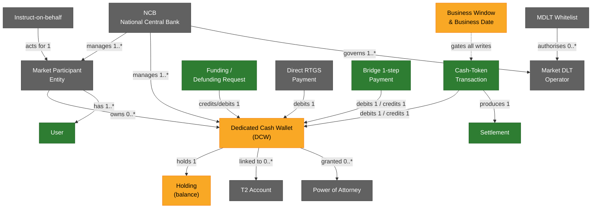
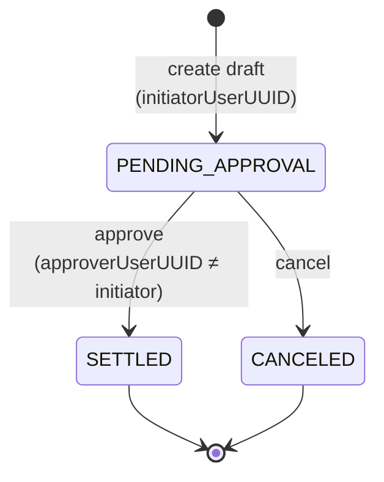
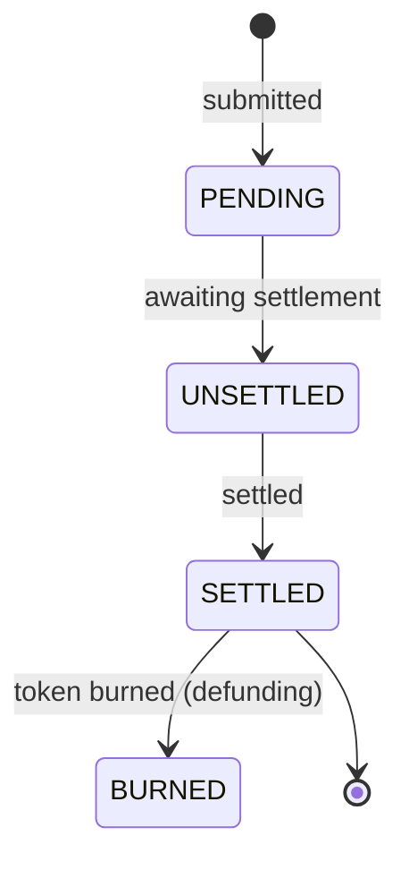
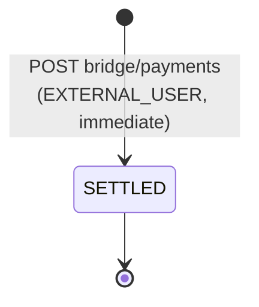

# Pontes domain model (objects, cardinalities & lifecycles)

A functional map of the concepts the ECB Pontes A2A API manipulates — the
business objects, how they relate (cardinalities), their key fields, and how
their state changes — plus **which concepts this mock implements today**.

> Scope: this is a **functional** model. Security/transport layers (mTLS, OAuth2
> JWT, NRO signing) are intentionally **excluded** — except the **User** concept,
> which is a first-class functional object. For the security layers see
> [`TLS-MTLS-AND-CERTS.md`](TLS-MTLS-AND-CERTS.md). For endpoint-by-endpoint
> coverage see [`ENDPOINT-COVERAGE.md`](ENDPOINT-COVERAGE.md).
>
> Source: the vendored official spec `src/ui/spec/pontes-official-v1.0.json`
> (EII API v1.0.0).

## Legend

| Colour | Meaning |
|--------|---------|
| 🟢 **Implemented** | the mock exposes and drives this concept |
| 🟡 **Partial** | present but simplified (e.g. read-only, auto-created, not enforced) |
| ⚪ **Not implemented** | defined by the official API, not in the mock yet |

---

## 1. Concept map

---

## 2. Concepts

### 2.1 NCB (National Central Bank) ⚪

The managing central bank / realm. Every object is scoped to an NCB (the `{ncb}`
path segment and the OAuth realm). Referenced by `managerID` / `managerNCB` on
wallets and entities.

- Key fields: `bic`, `name`, `country`.
- Cardinality: **1 NCB → many** Entities, DCWs, Market DLT Operators.
- Official endpoints: `GET .../grs/ncbs`, `.../grs/ncbs/{id}`. **Not implemented**
  (the mock hard-codes the NCB from the realm).

### 2.2 Market Participant Entity ⚪

A participant in the ESY DLT (a bank/PSP), identified by BIC.

- Key fields: `entityID`, `entityIDType` (`BIC`), `name`, `shortName`,
  `countryCode`, `isBlocked`, `isPrivate`, `status`, `fourEyesType`, `mspID`,
  `rolesTable`, `historicStatus`.
- Cardinality: owns **0..\*** DCWs; groups **1..\*** Users.
- Official endpoints: `grs/entities` (create 2-step, list, get, patch blocking).
  **Not implemented** — the mock infers the owning entity from the wallet alias
  / enrolled user's `entityBIC`.

### 2.3 User 🟢

A named human/service identity that authenticates and initiates/approves
operations. **The only security-adjacent object included here.**

- Key fields: `username`, `entity`/`externalEntity`, `roles`, `email`, `enabled`,
  `networkID`, plus (mock) `profile` (`PILOT_READ_WRITE`, `EXTERNAL_USER`, …) and
  `entityBIC`.
- Cardinality: belongs to **1** Entity; a 2-step operation involves **2 distinct**
  Users (`initiatorUserUUID` ≠ `approverUserUUID`).
- Mock: declared + certificate-enrolled via the IAM/Keycloak endpoints
  (`.../openid-connect/token`, `/csr`, `/certs`, `admin/enrolled-users`).

### 2.4 Dedicated Cash Wallet (DCW) 🟡

The cash-token account holding a balance.

- Key fields: `walletAlias`, `ownerEntityID`, `managerID` (NCB), `isMainWallet`,
  `status`, `fourEyesType`, `validFrom`/`validTo`, `holdingTable`,
  `t2AccountWalletLinks`, `POAs`.
- Cardinality: owned by **1** Entity, managed by **1** NCB; holds **1** Holding
  per currency; linked to **0..\*** T2 Accounts.
- Official: create (2-step), list, get, get settled transactions, total-under-mgmt.
- Mock: **read** (`GET .../ams/wallets`, `.../{walias}`, `.../transactions`)
  implemented; wallets are **auto-created** on first reference (no creation
  draft); no `validFrom/validTo`, PoA, or T2 link modelling.

### 2.5 Holding 🟡

A balance line inside a DCW.

- Key fields: `holdingID`, `walletAlias`, `amount`, `type`, `modalityType`.
- Cardinality: **1 DCW → 1..\*** Holdings (per currency/modality). Mock tracks a
  single EUR `balance` string per wallet.

### 2.6 T2 Account ⚪

An RTGS (TARGET2) account reference a DCW is linked to for funding/defunding.

- Key fields: `accountReference`, `managerID`, `status`, `fourEyesType`, `links`.
- Cardinality: linked to **0..\*** DCWs via `T2AccountWalletLink`.
- Official: create (2-step), list, get. **Not implemented** — funding treats the
  token-issuance wallet as an infinite source instead.

### 2.7 Power of Attorney (PoA) ⚪

Authorises a party to operate a DCW on behalf of the owner.

- Cardinality: **0..\*** per DCW.
- Official: `ams/poa-drafts` (create 2-step), `ams/poa/{id}`. **Not implemented.**

### 2.8 Cash-Token Transaction 🟢

A wallet-to-wallet cash-token transfer/payment (2-step).

- Key fields: `instructionID`/`instructionLTID`, `amountTransferred`, `currency`
  (`EUR`), `creditedCashWalletAlias`, `debitedCashWalletAlias`,
  `creditedCashWalletManagerID`, `debitedCashWalletManagerID`, `type`,
  `cbdcRequestType`, `instructingPartyID`, `status`, and the non-official
  `supplementaryData` ("reason of payment").
- Cardinality: debits **1** DCW, credits **1** DCW; produces **1** Settlement.
- Mock: `POST .../rvs/transactions-requests` (draft) + `PUT .../transactions-drafts/{id}/approve|cancel`.

### 2.9 Settlement 🟢 (read) / octopus.Settlement

The settled record of a transaction / funding movement (the transactions query).

- Key fields: `settlementID`, `amount`, `currency`, `moveSource`/`moveDestination`
  (+ manager/owner), `moveDirection`, `moveType`, `settlementDate`/`settlementTime`,
  `operationContext` (`Cross`/`Intra`), `supplementaryData`.
- Mock: surfaced via `GET .../ims/transactions` (returns in-flight drafts rather
  than the full settled-extract model).

### 2.10 Funding / Defunding Request 🟢

Moves cash between a T2 account and a DCW (2-step, NRO-signed).

- Key fields: `techFundRequestID`, `amount`, `currency`, `type`,
  `creditedCashWalletAlias`/`ManagerID`/`OwnerID`,
  `debitedCashWalletAlias`/`ManagerID`/`OwnerID`, `signature`, `signerPEM`.
- Cardinality: credits (funding) or debits (defunding) **1** DCW.
- Mock: `POST .../tms/funding-requests` & `.../defunding-requests` (draft) +
  `.../{id}/approve` (funding also `cancel`; defunding approve-only). The
  token-issuance wallet is treated as an **infinite** source.

### 2.11 Direct RTGS Payment ⚪

A payment settling directly on RTGS. Official: `tms/direct-rtgs/payments` and the
`bridge/direct-rtgs/payments` variant (2-step / 1-step). **Not implemented.**

### 2.12 Bridge 1-step Payment 🟢 (cash-token) / ⚪ (PFoD, XvP)

Immediate settlement, no draft/approve cycle.

- Key fields (`bridge.PaymentRequest`): `paymentID`, `amount`, `currency`,
  `creditedCashWalletAlias`/`ManagerID`, `debitedCashWalletAlias`/`ManagerID`.
- Mock: `POST .../bridge/payments` implemented (EXTERNAL_USER). **PFoD**
  (`initpfoddeli`/`initpfodrece`) and **XvP** (`/igw/**`) **not implemented**.

### 2.13 Market DLT Operator & Whitelist ⚪

Registry of DLT platform operators and their authorisation whitelist.

- `MarketDLTOperator`: `mdltOperatorID`, `operatorID`, `networkID`,
  `responsibleNCB`, `isBlocked`.
- Cardinality: a Whitelist authorises **0..\*** operators. **Not implemented.**

### 2.14 Instruct-on-behalf ⚪

An operation an operator instructs for another entity. Official:
`tms/instruct-on-behalf-drafts`. **Not implemented.**

### 2.15 Business Window & Business Date 🟡

The market calendar gating when operations may settle.

- `BusinessWindow`: `windowName` (Start of Day / Open for All / End of Day /
  Closed), `startTime`, `endTime`, `nextWindowName`.
- `BusinessDate`: `businessDate`, `updateBDStatus`
  (`FULL_UPDATE_ALLOWED` / `UPDATE_NOT_ALLOWED` / `CONDITIONAL_UPDATE_ALLOWED`).
- Mock: `GET .../bridge/current-business-window`, `.../grs/current-business-window`,
  `.../grs/businessdate` implemented, **but the window is not enforced** on writes.

---

## 3. Lifecycles (state changes)

### 3.1 The 2-step (4-eyes) draft lifecycle

Every create operation on Wallets, T2 Accounts, Entities, Transactions,
Funding/Defunding, Direct RTGS, mDLT Operators/Whitelists, PoA and
Instruct-on-behalf follows the same shape — the `{status}` path segment is always
`approve` or `cancel`, and the approver must differ from the initiator.

In the mock this is implemented for **transactions** and **funding/defunding**
(🟢); the same lifecycle for **entities, wallets, T2 accounts, PoA, mDLT** is ⚪
not implemented. Behaviour: `404` on unknown draft, `409` if not `PENDING_APPROVAL`.

### 3.2 Settlement / payment status

`PaymentStatus` enum on settled records:

The mock settles **immediately** on approval (drafts jump straight to `SETTLED`);
`UNSETTLED`/`BURNED` intermediate states are not modelled.

### 3.3 1-step bridge payment

---

## 4. Implementation status summary

| Concept | Status | Mock surface |
|---------|--------|--------------|
| User (IAM) | 🟢 | token / csr / certs / enrolled-users |
| Cash-Token Transaction | 🟢 | rvs transactions-requests + approve/cancel |
| Funding / Defunding | 🟢 | tms funding/defunding-requests + approve |
| Bridge 1-step payment | 🟢 | bridge/payments |
| Settlement query | 🟢 | ims/transactions (drafts) |
| Dedicated Cash Wallet | 🟡 | read + auto-create; no creation draft |
| Holding / balance | 🟡 | single EUR balance per wallet |
| Business Window / Date | 🟡 | read only, not enforced |
| Market Participant Entity | ⚪ | — |
| NCB registry | ⚪ | — |
| T2 Account | ⚪ | — |
| Power of Attorney | ⚪ | — |
| Direct RTGS Payment | ⚪ | — |
| PFoD / XvP | ⚪ | — |
| Market DLT Operator / Whitelist | ⚪ | — |
| Instruct-on-behalf | ⚪ | — |
| Closed days | ⚪ | — |

> When implementing more official endpoints, extend the 🟡/⚪ rows above and the
> concept map colours in §1.
